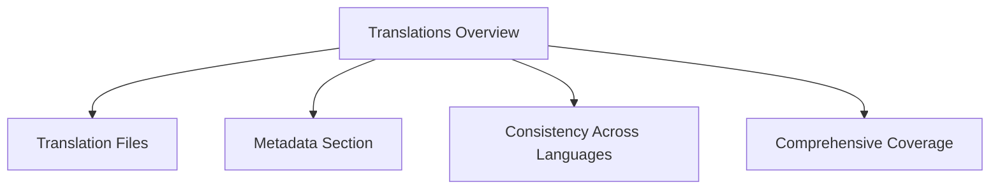

````mermaid

````

# Translations Overview

Translations refer to the localization of text strings used in the application into different languages. This ensures that users can interact with the application in their preferred language.

# Translation Files

The translations are stored in JSON files within the `i18n` directory. Each file corresponds to a specific language and contains key-value pairs where the key is the identifier for the text string, and the value is the translated text.

<SwmSnippet path="/i18n/en-gb.json" line="1">

---

Example of a translation file for British English. It includes various translations and metadata about the authors.

```json
{
	"@metadata": {
		"authors": [
			"Bjh21",
			"Dreamy Jazz",
			"Mako001",
			"Reedy",
			"Samwilson",
			"Shirayuki"
		]
	},
	"mwoauth-desc": "Allows usage of OAuth 1.0a and OAuth 2.0 for API authorisation",
	"mwoauth-consumer-owner-only-help": "Selecting this option will cause the consumer to be automatically approved and accepted for use by $1. It will not be usable by any other user, and the usual authorisation flow will not function. Actions taken using this consumer will not be tagged.",
	"mwoauthconsumerregistration-propose-text-oauth1": "Developers should use the form below to propose a new OAuth 1.0a consumer (see the [https://www.mediawiki.org/wiki/Special:MyLanguage/Extension:OAuth extension documentation] for more details). After submitting this form, you will receive a token that your application will use to identify itself to MediaWiki. Depending on what capabilities you request, an OAuth administrator might need to approve your application before it can be authorised by other users.\n\nA few recommendations and remarks:\n* Try to use as few grants as possible. Avoid grants that are not actually needed now.\n* Versions are of the form \"major.minor.release\" (the last two being optional) and increase as grant changes are needed.\n* Please provide a public RSA key (in PEM format) if possible; otherwise a (less secure) secret token will have to be used.\n* You can use a project ID to restrict the consumer to a single project on this site (use \"*\" for all projects).",
	"mwoauthconsumerregistration-propose-text-oauth2": "Developers should use the form below to request a token for a new OAuth 2.0 client (see the [https://www.mediawiki.org/wiki/Special:MyLanguage/Extension:OAuth extension documentation] for more details). After submitting this form, you will receive a token that your application will use to identify itself to MediaWiki. Depending on what capabilities you request, an OAuth administrator might need to approve your application before it can be authorised by other users.\n\nA few recommendations and remarks:\n* Try to use as few scopes as possible. Avoid scopes that are not actually needed now.\n* Versions are of the form \"major.minor.release\" (the last two being optional) and increase as scope changes are needed.\n* You can use a project ID to restrict the consumer to a single project on this site (use \"*\" for all projects).",
	"mwoauthmanagemygrants-text": "This page lists any applications that can use your account. For any such application, the scope of its access is limited by the permissions that you granted to the application when you authorised it to act on your behalf. If you separately authorised an application to access different \"sister\" projects on your behalf, then you will see separate configuration for each such project below.\n\nConnected applications access your account by using the OAuth protocol. <span class=\"plainlinks\">([https://www.mediawiki.org/wiki/Special:MyLanguage/Help:OAuth Learn more about connected applications])</span>",
	"mwoauthmanagemygrants-renounce": "Deauthorise",
	"mwoauthdatastore-access-token-not-found": "No approved grant was found for that authorisation token.",
	"mwoauth-invalid-authorization-title": "OAuth authorisation error",
	"mwoauth-invalid-authorization": "The authorisation headers in your request are not valid: $1",
	"mwoauth-invalid-authorization-wrong-wiki": "The authorisation headers in your request are not valid for $1",
```

---

</SwmSnippet>

# Metadata Section

The <SwmToken path="i18n/en-gb.json" pos="2:2:3" line-data="	&quot;@metadata&quot;: {">`@metadata`</SwmToken> section in each translation file includes information about the authors who contributed to the translations. This helps in maintaining and updating the translations by keeping track of contributors.

<SwmSnippet path="/i18n/en-gb.json" line="2">

---

Example of the <SwmToken path="i18n/en-gb.json" pos="2:2:3" line-data="	&quot;@metadata&quot;: {">`@metadata`</SwmToken> section in the British English translation file.

```json
	"@metadata": {
		"authors": [
			"Bjh21",
			"Dreamy Jazz",
			"Mako001",
			"Reedy",
			"Samwilson",
			"Shirayuki"
		]
	},
```

---

</SwmSnippet>

# Consistency Across Languages

The translation keys are consistent across all language files, ensuring that the same functionality is translated uniformly across different languages. This consistency is crucial for maintaining the integrity of the application's user interface.

# Comprehensive Coverage

The translation files cover various aspects of the application, including descriptions, error messages, and user interface elements. This comprehensive coverage ensures that users have a seamless experience regardless of their language preference.

&nbsp;

*This is an auto-generated document by Swimm AI 🌊 and has not yet been verified by a human*

<SwmMeta version="3.0.0" repo-id="Z2l0aHViJTNBJTNBbWVkaWF3aWtpLWV4dGVuc2lvbnMtT0F1dGglM0ElM0FTd2ltbS1EZW1v" repo-name="mediawiki-extensions-OAuth"><sup>Powered by [Swimm](/)</sup></SwmMeta>
