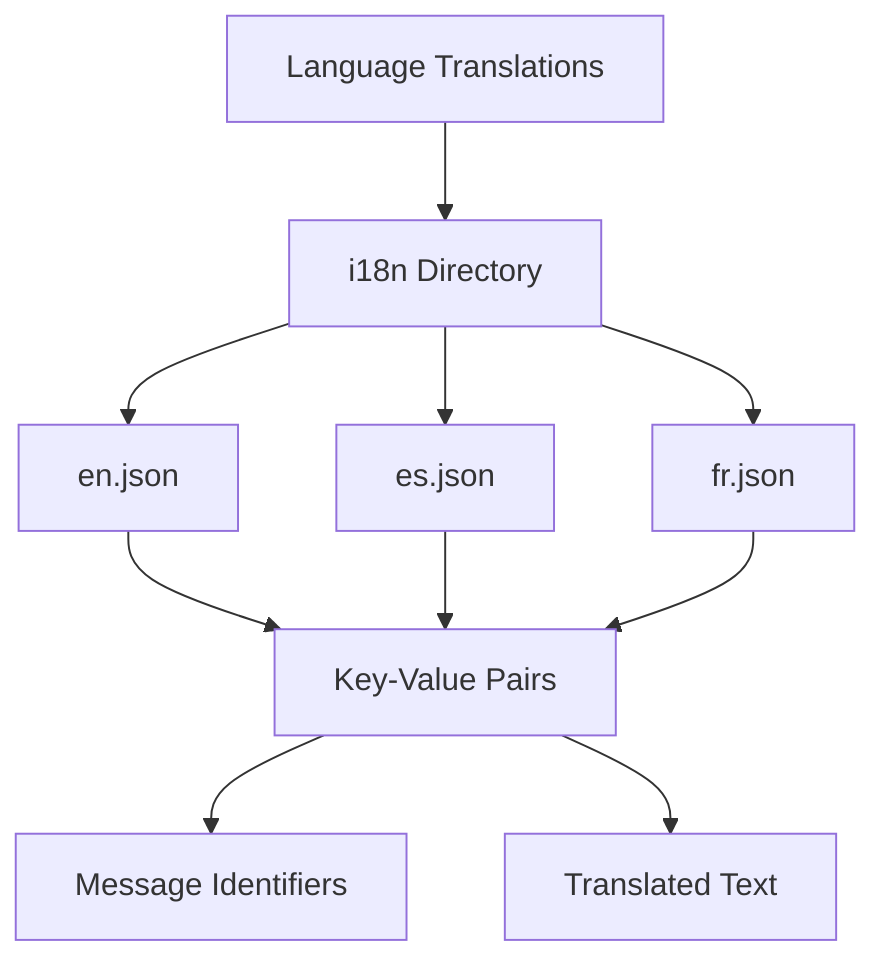

# Overview

Language translations refer to the various language files available in the `i18n` directory. These files are used to provide translations for different languages. Each file in the `i18n` directory corresponds to a specific language or dialect, identified by its filename. For example, <SwmPath>[i18n/en.json](i18n/en.json)</SwmPath> is for English, <SwmPath>[i18n/es.json](i18n/es.json)</SwmPath> is for Spanish, and <SwmPath>[i18n/fr.json](i18n/fr.json)</SwmPath> is for French.

# Structure of Translation Files

These translation files contain key-value pairs where the key is a message identifier and the value is the translated text. This allows the application to display messages in the user's preferred language. The translation files are essential for internationalization, enabling the application to support multiple languages and provide a localized experience for users around the world.

# Example Translation Files

Below are examples of different translation files and their contents.

<SwmSnippet path="/i18n/es.json" line="241">

---

This file provides translations for Spanish. For example, the key <SwmToken path="i18n/es.json" pos="241:2:6" line-data="	&quot;mwoauth-tag-reserved&quot;: &quot;Las etiquetas que comienzan con &lt;code&gt;OAuth CID:&lt;/code&gt; están reservadas para que las use OAuth.&quot;,">`mwoauth-tag-reserved`</SwmToken> is translated to <SwmToken path="i18n/es.json" pos="241:11:44" line-data="	&quot;mwoauth-tag-reserved&quot;: &quot;Las etiquetas que comienzan con &lt;code&gt;OAuth CID:&lt;/code&gt; están reservadas para que las use OAuth.&quot;,">`Las etiquetas que comienzan con <code>OAuth CID:</code> están reservadas para que las use OAuth.`</SwmToken>

```json
	"mwoauth-tag-reserved": "Las etiquetas que comienzan con <code>OAuth CID:</code> están reservadas para que las use OAuth.",
```

---

</SwmSnippet>

<SwmSnippet path="/i18n/qqq.json" line="52">

---

This file provides context and descriptions for translators. For example, <SwmToken path="i18n/qqq.json" pos="52:2:6" line-data="	&quot;mwoauth-consumer-callbackisprefix&quot;: &quot;Used as a label for the check box where user can decide if their consumer should use \&quot;Callback URL\&quot; as a string prefix (checked), or if the consumer cannot customize the callback URL in its requests as is required to specify \&quot;oob\&quot; (unchecked, default).&quot;,">`mwoauth-consumer-callbackisprefix`</SwmToken> is used as a label for a checkbox where users can decide if their consumer should use <SwmToken path="i18n/qqq.json" pos="52:47:49" line-data="	&quot;mwoauth-consumer-callbackisprefix&quot;: &quot;Used as a label for the check box where user can decide if their consumer should use \&quot;Callback URL\&quot; as a string prefix (checked), or if the consumer cannot customize the callback URL in its requests as is required to specify \&quot;oob\&quot; (unchecked, default).&quot;,">`Callback URL`</SwmToken> as a string prefix.

```json
	"mwoauth-consumer-callbackisprefix": "Used as a label for the check box where user can decide if their consumer should use \"Callback URL\" as a string prefix (checked), or if the consumer cannot customize the callback URL in its requests as is required to specify \"oob\" (unchecked, default).",
	"mwoauth-consumer-granttypes": "Used as label to select between authorization-only (with or without private info) and normal API access",
	"mwoauth-consumer-grantsneeded": "Used as label.\n\nFollowed by the list of grants.\n{{Identical|Applicable grant}}",
	"mwoauth-consumer-required-grant": "Used as table column header.",
	"mwoauth-consumer-wiki": "Used as label for the input box. The default value for the input box is \"*\".\n{{Identical|Applicable project}}",
	"mwoauth-consumer-wiki-thiswiki": "Label for selection-list option, indicating the wiki this user is currently visiting.\n\nParameters:\n* $1 - wiki ID",
	"mwoauth-consumer-restrictions": "Used as label for the textarea. (The value is written in JSON format.)\n\nFollowed by the textarea or the message {{msg-mw|Mwoauthmanageconsumers-field-hidden}}.\n{{Identical|Usage restriction}}",
	"mwoauth-consumer-restrictions-json": "Used as label for the \"Restrictions\" textarea.\n{{Identical|Usage restriction}}",
	"mwoauth-consumer-rsakey": "Used as label for the textarea.\n\nFollowed by the textarea or the message {{msg-mw|Mwoauthmanageconsumers-field-hidden}}.",
	"mwoauth-consumer-rsakey-help": "Used as help message for the textarea, on the consumer registration form.",
	"mwoauth-consumer-secretkey": "Used as label for the textarea.",
	"mwoauth-consumer-accesstoken": "Unused at this time.",
	"mwoauth-consumer-reason": "Used as label for the \"Reason\" value.\n{{Identical|Reason}}",
	"mwoauth-consumer-developer-agreement": "Agreement shown on application form, indicating that the app author understands their responsibilities by submitting this form.\n\n\"Application\" means \"app, software application\".",
	"mwoauth-consumer-email-unconfirmed": "Used as failure message when taking some action which requires email-confirmation.",
	"mwoauth-consumer-email-mismatched": "Used as failure message when taking some action.",
	"mwoauth-consumer-alreadyexists": "Used as failure message.",
	"mwoauth-consumer-alreadyexistsversion": "Used as failure message. Parameters:\n* $1 - current consumer version number",
	"mwoauth-consumer-not-accepted": "Unused at this time.",
	"mwoauth-consumer-not-proposed": "Used as failure message when approving or rejecting the consumer.\n\nSee also:\n* {{msg-mw|Mwoauth-consumer-not-disabled}}",
	"mwoauth-consumer-not-disabled": "Used as failure message when re-enabling the consumer.\n\nSee also:\n* {{msg-mw|Mwoauth-consumer-not-proposed}}",
```

---

</SwmSnippet>

&nbsp;

*This is an auto-generated document by Swimm AI 🌊 and has not yet been verified by a human*

<SwmMeta version="3.0.0" repo-id="Z2l0aHViJTNBJTNBbWVkaWF3aWtpLWV4dGVuc2lvbnMtT0F1dGglM0ElM0FTd2ltbS1EZW1v" repo-name="mediawiki-extensions-OAuth"><sup>Powered by [Swimm](/)</sup></SwmMeta>
