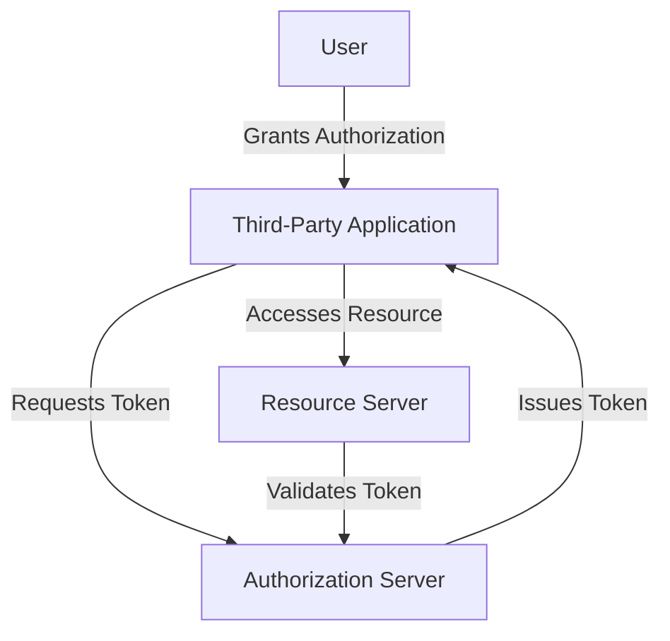

# Introduction

<SwmToken path="src/Lib/OAuthServer.php" pos="48:14:14" line-data="		$this-&gt;logger = LoggerFactory::getInstance( &#39;OAuth&#39; );">`OAuth`</SwmToken> is a protocol used for authorization, allowing third-party services to exchange user information without exposing user credentials. This document provides an overview of the <SwmToken path="src/Lib/OAuthServer.php" pos="48:14:14" line-data="		$this-&gt;logger = LoggerFactory::getInstance( &#39;OAuth&#39; );">`OAuth`</SwmToken> schema implementation in the project.

# <SwmToken path="src/Lib/OAuthServer.php" pos="48:14:14" line-data="		$this-&gt;logger = LoggerFactory::getInstance( &#39;OAuth&#39; );">`OAuth`</SwmToken> Schema Overview

In the schema, <SwmToken path="src/Lib/OAuthServer.php" pos="48:14:14" line-data="		$this-&gt;logger = LoggerFactory::getInstance( &#39;OAuth&#39; );">`OAuth`</SwmToken> is implemented through various SQL tables and scripts that manage access tokens, grants, and other related data.

# Access Tokens

The <SwmPath>[schema/oauth2_access_tokens.sql](schema/oauth2_access_tokens.sql)</SwmPath> file defines the structure for storing <SwmToken path="src/SessionProvider.php" pos="137:11:11" line-data="					throw new MWOAuthException( &#39;mwoauth-oauth2-error-create-at-no-user-approval&#39; );">`oauth2`</SwmToken> access tokens, including fields for the token identifier, expiration timestamp, acceptance ID, and revocation status.

# Confidential Clients

The <SwmPath>[schema/oauth2_is_confidential.sql](schema/oauth2_is_confidential.sql)</SwmPath> file indicates whether a particular <SwmToken path="src/SessionProvider.php" pos="137:11:11" line-data="					throw new MWOAuthException( &#39;mwoauth-oauth2-error-create-at-no-user-approval&#39; );">`oauth2`</SwmToken> client is confidential, which affects how tokens and secrets are managed.

# Version Control

The <SwmPath>[schema/oauth_version_accepted.sql](schema/oauth_version_accepted.sql)</SwmPath> and <SwmPath>[schema/oauth_version_registered.sql](schema/oauth_version_registered.sql)</SwmPath> files manage the versions of <SwmToken path="src/Lib/OAuthServer.php" pos="48:14:14" line-data="		$this-&gt;logger = LoggerFactory::getInstance( &#39;OAuth&#39; );">`OAuth`</SwmToken> that are accepted and registered, ensuring compatibility and proper version control.

# Indexing

The <SwmPath>[schema/index_on_oaat_acceptance_id.sql](schema/index_on_oaat_acceptance_id.sql)</SwmPath> file creates an index on the acceptance ID field in the `oauth2_access_tokens` table, optimizing queries that involve this field.

<SwmSnippet path="/src/Lib/OAuthRequest.php" line="34">

---

# <SwmToken path="src/Lib/OAuthRequest.php" pos="34:2:2" line-data="class OAuthRequest {">`OAuthRequest`</SwmToken> Class

The <SwmToken path="src/Lib/OAuthRequest.php" pos="34:2:2" line-data="class OAuthRequest {">`OAuthRequest`</SwmToken> class is used to create and manage <SwmToken path="src/Lib/OAuthServer.php" pos="48:14:14" line-data="		$this-&gt;logger = LoggerFactory::getInstance( &#39;OAuth&#39; );">`OAuth`</SwmToken> requests. It handles the HTTP method, URL, and parameters for the request.

```hack
class OAuthRequest {
	protected $parameters;
	protected $http_method;
	protected $http_url;
	// for debug purposes
	public $base_string;
	public static $version = '1.0';
	public static $POST_INPUT = 'php://input';

	/** @var LoggerInterface */
	protected $logger;

	function __construct( $http_method, $http_url, $parameters = null ) {
		$parameters = $parameters ?: array();
		$parameters = array_merge(
			OAuthUtil::parse_parameters( parse_url( $http_url, PHP_URL_QUERY ) ),
			$parameters
		);
		$this->parameters = $parameters;
		$this->http_method = $http_method;
		$this->http_url = $http_url;
```

---

</SwmSnippet>

<SwmSnippet path="/src/OAuthServices.php" line="9">

---

# <SwmToken path="src/OAuthServices.php" pos="9:2:2" line-data="class OAuthServices {">`OAuthServices`</SwmToken> Class

The <SwmToken path="src/OAuthServices.php" pos="9:2:2" line-data="class OAuthServices {">`OAuthServices`</SwmToken> class provides access to core services needed for <SwmToken path="src/Lib/OAuthServer.php" pos="48:14:14" line-data="		$this-&gt;logger = LoggerFactory::getInstance( &#39;OAuth&#39; );">`OAuth`</SwmToken> operations, such as configuration and workflow management.

```hack
class OAuthServices {

	/** @var MediaWikiServices */
	private $coreServices;

	/**
	 * @param MediaWikiServices $coreServices
	 */
	public function __construct( MediaWikiServices $coreServices ) {
		$this->coreServices = $coreServices;
	}

	/**
	 * Static version of the constructor, for nicer syntax.
	 * @param MediaWikiServices $coreServices
	 * @return static
	 */
	public static function wrap( MediaWikiServices $coreServices ) {
		return new static( $coreServices );
	}
```

---

</SwmSnippet>

<SwmSnippet path="/src/Lib/OAuthUtil.php" line="31">

---

# <SwmToken path="src/Lib/OAuthUtil.php" pos="31:2:2" line-data="class OAuthUtil {">`OAuthUtil`</SwmToken> Class

The <SwmToken path="src/Lib/OAuthUtil.php" pos="31:2:2" line-data="class OAuthUtil {">`OAuthUtil`</SwmToken> class contains utility functions for encoding, decoding, and parsing <SwmToken path="src/Lib/OAuthServer.php" pos="48:14:14" line-data="		$this-&gt;logger = LoggerFactory::getInstance( &#39;OAuth&#39; );">`OAuth`</SwmToken> parameters and headers.

```hack
class OAuthUtil {
	public static function urlencode_rfc3986( $input ) {
		if ( is_array( $input ) ) {
			return array_map(
				array(
					self::class,
					'urlencode_rfc3986'
				),
				$input
			);
		} else {
			if ( is_scalar( $input ) ) {
				return str_replace(
					'+',
					' ',
					str_replace( '%7E', '~', rawurlencode( $input ) )
				);
			} else {
				return '';
			}
		}
```

---

</SwmSnippet>

<SwmSnippet path="/src/Lib/OAuthToken.php" line="29">

---

# <SwmToken path="src/Lib/OAuthToken.php" pos="29:2:2" line-data="class OAuthToken {">`OAuthToken`</SwmToken> Class

The <SwmToken path="src/Lib/OAuthToken.php" pos="29:2:2" line-data="class OAuthToken {">`OAuthToken`</SwmToken> class represents an <SwmToken path="src/Lib/OAuthServer.php" pos="48:14:14" line-data="		$this-&gt;logger = LoggerFactory::getInstance( &#39;OAuth&#39; );">`OAuth`</SwmToken> token, including its key and secret. It provides methods for serializing the token.

```hack
class OAuthToken {
	// access tokens and request tokens
	public $key;
	public $secret;

	/**
	 * key = the token
	 * secret = the token secret
	 */
	function __construct( $key, $secret ) {
		$this->key = $key;
		$this->secret = $secret;
	}

	/**
	 * generates the basic string serialization of a token that a server
	 * would respond to request_token and access_token calls with
	 */
	function to_string() {
		return "oauth_token=" . OAuthUtil::urlencode_rfc3986(
			$this->key
```

---

</SwmSnippet>

<SwmSnippet path="/src/Lib/OAuthServer.php" line="35">

---

# <SwmToken path="src/Lib/OAuthServer.php" pos="35:2:2" line-data="class OAuthServer {">`OAuthServer`</SwmToken> Class

The <SwmToken path="src/Lib/OAuthServer.php" pos="35:2:2" line-data="class OAuthServer {">`OAuthServer`</SwmToken> class handles the core <SwmToken path="src/Lib/OAuthServer.php" pos="48:14:14" line-data="		$this-&gt;logger = LoggerFactory::getInstance( &#39;OAuth&#39; );">`OAuth`</SwmToken> operations, such as fetching request tokens, access tokens, and verifying requests.

```hack
class OAuthServer {
	protected $timestamp_threshold = 300; // in seconds, five minutes
	protected $version = '1.0'; // hi blaine
	protected $signature_methods = array();

	/** @var OAuthDataStore */
	protected $data_store;

	/** @var LoggerInterface */
	protected $logger;

	function __construct( $data_store ) {
		$this->data_store = $data_store;
		$this->logger = LoggerFactory::getInstance( 'OAuth' );
	}

	public function add_signature_method( $signature_method ) {
		$this->signature_methods[$signature_method->get_name()] = $signature_method;
	}

	// high level functions
```

---

</SwmSnippet>

<SwmSnippet path="/src/Lib/OAuthSignatureMethodPlaintext.php" line="29">

---

# <SwmToken path="src/Lib/OAuthSignatureMethodPlaintext.php" pos="34:2:2" line-data="class OAuthSignatureMethodPlaintext extends OAuthSignatureMethod {">`OAuthSignatureMethodPlaintext`</SwmToken> Class

The <SwmToken path="src/Lib/OAuthSignatureMethodPlaintext.php" pos="34:2:2" line-data="class OAuthSignatureMethodPlaintext extends OAuthSignatureMethod {">`OAuthSignatureMethodPlaintext`</SwmToken> class implements the PLAINTEXT signature method for <SwmToken path="src/Lib/OAuthServer.php" pos="48:14:14" line-data="		$this-&gt;logger = LoggerFactory::getInstance( &#39;OAuth&#39; );">`OAuth`</SwmToken>, which is used for signing requests.

```hack
/**
 * The PLAINTEXT method does not provide any security protection and SHOULD only be used
 * over a secure channel such as HTTPS. It does not use the Signature Base String.
 *     - Chapter 9.4 ( "PLAINTEXT" )
 */
class OAuthSignatureMethodPlaintext extends OAuthSignatureMethod {
	public function get_name() {
		return "PLAINTEXT";
	}

	/**
	 * oauth_signature is set to the concatenated encoded values of the Consumer Secret and
	 * Token Secret, separated by a '&' character ( ASCII code 38 ), even if either secret is
	 * empty. The result MUST be encoded again.
	 *     - Chapter 9.4.1 ( "Generating Signatures" )
	 *
	 * Please note that the second encoding MUST NOT happen in the SignatureMethod, as
	 * OAuthRequest handles this!
	 */
	public function build_signature( $request, $consumer, $token ) {
		$key_parts = array(
```

---

</SwmSnippet>

<SwmSnippet path="/src/SessionProvider.php" line="37">

---

# <SwmToken path="src/SessionProvider.php" pos="51:2:2" line-data="class SessionProvider">`SessionProvider`</SwmToken> Class

The <SwmToken path="src/SessionProvider.php" pos="51:2:2" line-data="class SessionProvider">`SessionProvider`</SwmToken> class manages <SwmToken path="src/SessionProvider.php" pos="38:9:9" line-data=" * Session provider for OAuth">`OAuth`</SwmToken> sessions, including verifying <SwmToken path="src/SessionProvider.php" pos="38:9:9" line-data=" * Session provider for OAuth">`OAuth`</SwmToken> headers and handling API requests.

```hack
/**
 * Session provider for OAuth
 *
 * This is a fairly standard ImmutableSessionProviderWithCookie implementation:
 * the user identity is determined by the OAuth headers included in the
 * request. But since we want to make sure to fail the request when OAuth
 * headers are present but invalid, this takes the somewhat unusual step of
 * returning a bogus SessionInfo and then hooking ApiBeforeMain to throw a
 * fatal exception after MediaWiki is ready to handle it.
 *
 * It also takes advantage of the getAllowedUserRights() method for authz
 * purposes (limiting the rights to those included in the grant), and
 * registers some hooks to tag actions made via the provider.
 */
class SessionProvider
	extends ImmutableSessionProviderWithCookie
	implements ApiCheckCanExecuteHook, RecentChange_saveHook, MarkPatrolledHook
{

	public function __construct( array $params = [] ) {
		parent::__construct( $params );
```

---

</SwmSnippet>

<SwmSnippet path="/src/Backend/Utils.php" line="20">

---

# Utils Class

The <SwmToken path="src/Backend/Utils.php" pos="26:2:2" line-data="class Utils {">`Utils`</SwmToken> class provides static utility functions for various <SwmToken path="src/Backend/Utils.php" pos="21:11:11" line-data=" * Static utility functions for OAuth">`OAuth`</SwmToken> operations, such as database access and header parsing.

```hack
/**
 * Static utility functions for OAuth
 *
 * @file
 * @ingroup OAuth
 */
class Utils {
	/**
	 * @return bool
	 */
	public static function isCentralWiki() {
		global $wgMWOAuthCentralWiki;

		return ( WikiMap::getCurrentWikiId() === $wgMWOAuthCentralWiki );
	}

	/**
	 * @return string|bool
	 */
	public static function getCentralWiki() {
		global $wgMWOAuthCentralWiki;
```

---

</SwmSnippet>

&nbsp;

*This is an auto-generated document by Swimm AI 🌊 and has not yet been verified by a human*

<SwmMeta version="3.0.0" repo-id="Z2l0aHViJTNBJTNBbWVkaWF3aWtpLWV4dGVuc2lvbnMtT0F1dGglM0ElM0FTd2ltbS1EZW1v" repo-name="mediawiki-extensions-OAuth"><sup>Powered by [Swimm](/)</sup></SwmMeta>
