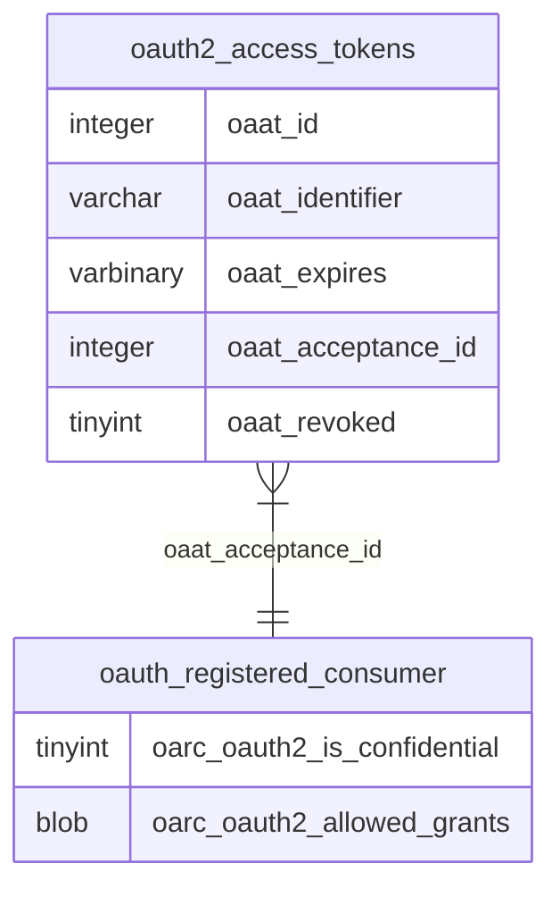

# Introduction

<SwmToken path="schema/oauth2_access_tokens.sql" pos="1:10:10" line-data="-- Access tokens used on OAuth2 requests">`OAuth2`</SwmToken> is a protocol used for authorization, allowing third-party applications to access user data without exposing user credentials. This document provides an overview of the <SwmToken path="schema/oauth2_access_tokens.sql" pos="1:10:10" line-data="-- Access tokens used on OAuth2 requests">`OAuth2`</SwmToken> schema, focusing on the <SwmToken path="schema/oauth2_access_tokens.sql" pos="2:13:13" line-data="CREATE TABLE IF NOT EXISTS /*_*/oauth2_access_tokens (">`oauth2_access_tokens`</SwmToken> and <SwmToken path="schema/oauth2_is_confidential.sql" pos="1:7:7" line-data="ALTER TABLE /*_*/oauth_registered_consumer">`oauth_registered_consumer`</SwmToken> tables.

# <SwmToken path="schema/oauth2_access_tokens.sql" pos="1:10:10" line-data="-- Access tokens used on OAuth2 requests">`OAuth2`</SwmToken> Access Tokens

The <SwmToken path="schema/oauth2_access_tokens.sql" pos="2:13:13" line-data="CREATE TABLE IF NOT EXISTS /*_*/oauth2_access_tokens (">`oauth2_access_tokens`</SwmToken> table stores access tokens used in <SwmToken path="schema/oauth2_access_tokens.sql" pos="1:10:10" line-data="-- Access tokens used on OAuth2 requests">`OAuth2`</SwmToken> requests. Each token is identified by the <SwmToken path="schema/oauth2_access_tokens.sql" pos="5:1:1" line-data="    oaat_identifier varchar(255) NOT NULL,">`oaat_identifier`</SwmToken> field and has an expiration timestamp stored in the <SwmToken path="schema/oauth2_access_tokens.sql" pos="7:1:1" line-data="    oaat_expires varbinary(14) NOT NULL,">`oaat_expires`</SwmToken> field.

<SwmSnippet path="/schema/oauth2_access_tokens.sql" line="1">

---

The <SwmToken path="schema/oauth2_access_tokens.sql" pos="2:13:13" line-data="CREATE TABLE IF NOT EXISTS /*_*/oauth2_access_tokens (">`oauth2_access_tokens`</SwmToken> table schema defines the structure for storing access tokens.

```plsql
-- Access tokens used on OAuth2 requests
CREATE TABLE IF NOT EXISTS /*_*/oauth2_access_tokens (
    oaat_id integer unsigned NOT NULL PRIMARY KEY auto_increment,
    -- Access token
    oaat_identifier varchar(255) NOT NULL,
```

---

</SwmSnippet>

# Token Expiration

The <SwmToken path="schema/oauth2_access_tokens.sql" pos="7:1:1" line-data="    oaat_expires varbinary(14) NOT NULL,">`oaat_expires`</SwmToken> field stores the expiration timestamp of the access token, ensuring tokens are valid only for a limited time.

<SwmSnippet path="/schema/oauth2_access_tokens.sql" line="5">

---

The <SwmToken path="schema/oauth2_access_tokens.sql" pos="7:1:1" line-data="    oaat_expires varbinary(14) NOT NULL,">`oaat_expires`</SwmToken> field schema defines how the expiration timestamp is stored.

```plsql
    oaat_identifier varchar(255) NOT NULL,
    -- Expiration timestamp
    oaat_expires varbinary(14) NOT NULL,
```

---

</SwmSnippet>

# Token Acceptance

The <SwmToken path="schema/oauth2_access_tokens.sql" pos="9:1:1" line-data="    oaat_acceptance_id integer unsigned NOT NULL,">`oaat_acceptance_id`</SwmToken> field links the token to the acceptance that allowed its creation, ensuring that only authorized tokens are used.

<SwmSnippet path="/schema/oauth2_access_tokens.sql" line="7">

---

The <SwmToken path="schema/oauth2_access_tokens.sql" pos="9:1:1" line-data="    oaat_acceptance_id integer unsigned NOT NULL,">`oaat_acceptance_id`</SwmToken> field schema defines how the acceptance identifier is stored.

```plsql
    oaat_expires varbinary(14) NOT NULL,
    -- Identifier of the acceptance that allows this access token to be created
    oaat_acceptance_id integer unsigned NOT NULL,
```

---

</SwmSnippet>

# Token Revocation

The <SwmToken path="schema/oauth2_access_tokens.sql" pos="11:1:1" line-data="    oaat_revoked tinyint NOT NULL DEFAULT 0">`oaat_revoked`</SwmToken> field indicates whether an access token has been revoked, providing a mechanism to invalidate tokens when necessary.

<SwmSnippet path="/schema/oauth2_access_tokens.sql" line="9">

---

The <SwmToken path="schema/oauth2_access_tokens.sql" pos="11:1:1" line-data="    oaat_revoked tinyint NOT NULL DEFAULT 0">`oaat_revoked`</SwmToken> field schema defines how the revocation status is stored.

```plsql
    oaat_acceptance_id integer unsigned NOT NULL,
    -- Indicates if the access token has been revoked
    oaat_revoked tinyint NOT NULL DEFAULT 0
```

---

</SwmSnippet>

# <SwmToken path="schema/oauth2_access_tokens.sql" pos="1:10:10" line-data="-- Access tokens used on OAuth2 requests">`OAuth2`</SwmToken> Client Configurations

The <SwmToken path="schema/oauth2_is_confidential.sql" pos="1:7:7" line-data="ALTER TABLE /*_*/oauth_registered_consumer">`oauth_registered_consumer`</SwmToken> table includes fields to manage <SwmToken path="schema/oauth2_access_tokens.sql" pos="1:10:10" line-data="-- Access tokens used on OAuth2 requests">`OAuth2`</SwmToken> client configurations, such as whether the client is confidential and the allowed grant types.

<SwmSnippet path="/schema/oauth2_is_confidential.sql" line="1">

---

The <SwmToken path="schema/oauth2_is_confidential.sql" pos="2:3:3" line-data="    ADD oarc_oauth2_is_confidential TINYINT NOT NULL DEFAULT 1;">`oarc_oauth2_is_confidential`</SwmToken> field schema defines whether the client is confidential.

```plsql
ALTER TABLE /*_*/oauth_registered_consumer
    ADD oarc_oauth2_is_confidential TINYINT NOT NULL DEFAULT 1;
```

---

</SwmSnippet>

<SwmSnippet path="/schema/oauth2_allowed_grants.sql" line="1">

---

The <SwmToken path="schema/oauth2_allowed_grants.sql" pos="2:3:3" line-data="    ADD oarc_oauth2_allowed_grants BLOB NULL;">`oarc_oauth2_allowed_grants`</SwmToken> field schema defines the allowed grant types for the client.

```plsql
ALTER TABLE /*_*/oauth_registered_consumer
    ADD oarc_oauth2_allowed_grants BLOB NULL;
```

---

</SwmSnippet>

&nbsp;

*This is an auto-generated document by Swimm AI 🌊 and has not yet been verified by a human*

<SwmMeta version="3.0.0" repo-id="Z2l0aHViJTNBJTNBbWVkaWF3aWtpLWV4dGVuc2lvbnMtT0F1dGglM0ElM0FTd2ltbS1EZW1v" repo-name="mediawiki-extensions-OAuth"><sup>Powered by [Swimm](/)</sup></SwmMeta>
