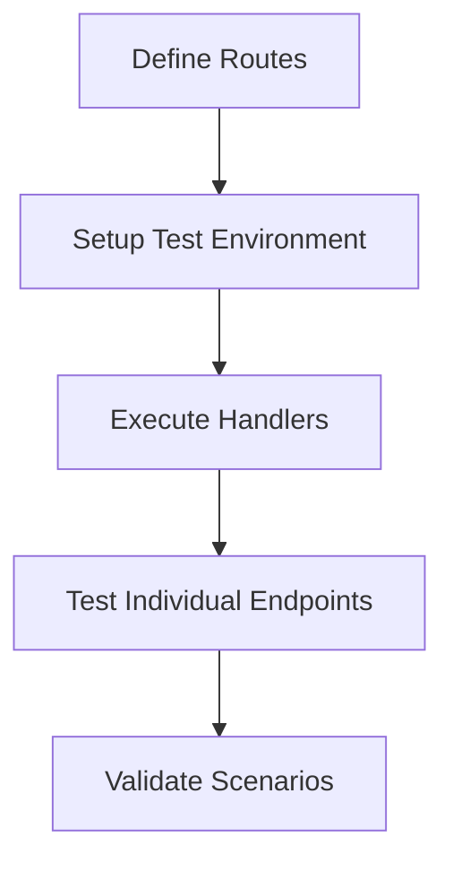

# Introduction

This document provides an overview of testing RESTful API endpoints within the <SwmToken path="tests/phpunit/Rest/testRoutes.json" pos="4:7:7" line-data="		&quot;factory&quot;: &quot;MediaWiki\\Extensions\\OAuth\\Rest\\Handler\\Authorize::factory&quot;">`MediaWiki`</SwmToken> <SwmToken path="tests/phpunit/Rest/testRoutes.json" pos="4:11:11" line-data="		&quot;factory&quot;: &quot;MediaWiki\\Extensions\\OAuth\\Rest\\Handler\\Authorize::factory&quot;">`OAuth`</SwmToken> extension. It covers defining routes, setting up the test environment, executing handlers, and testing individual endpoints.

# Defining Routes

The <SwmPath>[tests/phpunit/Rest/testRoutes.json](tests/phpunit/Rest/testRoutes.json)</SwmPath> file defines the routes and their corresponding handlers for the REST API endpoints. This file is crucial for mapping the endpoints to their respective handlers.

<SwmSnippet path="/tests/phpunit/Rest/testRoutes.json" line="4">

---

The <SwmPath>[tests/phpunit/Rest/testRoutes.json](tests/phpunit/Rest/testRoutes.json)</SwmPath> file contains route definitions and their corresponding handlers. For example, the <SwmToken path="tests/phpunit/Rest/testRoutes.json" pos="7:7:10" line-data="		&quot;path&quot;: &quot;/oauth2/access_token&quot;,">`/oauth2/access_token`</SwmToken> route uses the <SwmToken path="tests/phpunit/Rest/testRoutes.json" pos="8:17:19" line-data="		&quot;factory&quot;: &quot;MediaWiki\\Extensions\\OAuth\\Rest\\Handler\\AccessToken::factory&quot;,">`AccessToken::factory`</SwmToken> handler and supports the POST method.

```json
		"factory": "MediaWiki\\Extensions\\OAuth\\Rest\\Handler\\Authorize::factory"
	},
	{
		"path": "/oauth2/access_token",
		"factory": "MediaWiki\\Extensions\\OAuth\\Rest\\Handler\\AccessToken::factory",
		"method": "POST"
	},
	{
		"path": "/oauth2/resource/{{type}}",
		"factory": "MediaWiki\\Extensions\\OAuth\\Rest\\Handler\\Resource::factory"
	},
	{
		"path": "/oauth2/client",
		"class": "MediaWiki\\Extensions\\OAuth\\Rest\\Handler\\RequestClient",
		"method": "POST"
	},
	{
		"path": "/oauth2/client/{client_key}/reset_secret",
		"class": "MediaWiki\\Extensions\\OAuth\\Rest\\Handler\\ResetClientSecret",
```

---

</SwmSnippet>

# Base Class for Testing

The <SwmToken path="tests/phpunit/Rest/EndpointTestBase.php" pos="23:4:4" line-data="abstract class EndpointTestBase extends MediaWikiIntegrationTestCase {">`EndpointTestBase`</SwmToken> class provides a base for testing REST API endpoints. It includes methods for setting up the test environment and executing handlers, ensuring a consistent testing framework.

<SwmSnippet path="/tests/phpunit/Rest/EndpointTestBase.php" line="3">

---

The <SwmToken path="tests/phpunit/Rest/EndpointTestBase.php" pos="23:4:4" line-data="abstract class EndpointTestBase extends MediaWikiIntegrationTestCase {">`EndpointTestBase`</SwmToken> class sets up the necessary environment for testing REST API endpoints. It includes essential imports and configurations.

```hack
namespace MediaWiki\Extension\OAuth\Tests\Rest;

use Exception;
use FormatJson;
use GuzzleHttp\Psr7\Uri;
use MediaWiki\Context\RequestContext;
```

---

</SwmSnippet>

# Specific Endpoint Tests

Specific endpoint tests extend <SwmToken path="tests/phpunit/Rest/EndpointTestBase.php" pos="23:4:4" line-data="abstract class EndpointTestBase extends MediaWikiIntegrationTestCase {">`EndpointTestBase`</SwmToken> to test individual REST API endpoints. These tests validate various scenarios, including successful requests, error handling, and edge cases.

<SwmSnippet path="/tests/phpunit/Rest/RequestClientEndpointTest.php" line="3">

---

The <SwmToken path="tests/phpunit/Rest/RequestClientEndpointTest.php" pos="20:2:2" line-data="class RequestClientEndpointTest extends EndpointTestBase {">`RequestClientEndpointTest`</SwmToken> class extends <SwmToken path="tests/phpunit/Rest/EndpointTestBase.php" pos="23:4:4" line-data="abstract class EndpointTestBase extends MediaWikiIntegrationTestCase {">`EndpointTestBase`</SwmToken> to test the <SwmToken path="tests/phpunit/Rest/RequestClientEndpointTest.php" pos="7:12:12" line-data="use MediaWiki\Extension\OAuth\Rest\Handler\RequestClient;">`RequestClient`</SwmToken> endpoint. It includes necessary imports and configurations.

```hack
namespace MediaWiki\Extension\OAuth\Tests\Rest;

use Exception;
use FormatJson;
use MediaWiki\Extension\OAuth\Rest\Handler\RequestClient;
use MediaWiki\MainConfigNames;
```

---

</SwmSnippet>

# Validating Scenarios

These tests validate various scenarios, including successful requests, error handling, and edge cases, ensuring the robustness of the REST API.

&nbsp;

*This is an auto-generated document by Swimm AI 🌊 and has not yet been verified by a human*

<SwmMeta version="3.0.0" repo-id="Z2l0aHViJTNBJTNBbWVkaWF3aWtpLWV4dGVuc2lvbnMtT0F1dGglM0ElM0FTd2ltbS1EZW1v" repo-name="mediawiki-extensions-OAuth"><sup>Powered by [Swimm](/)</sup></SwmMeta>
