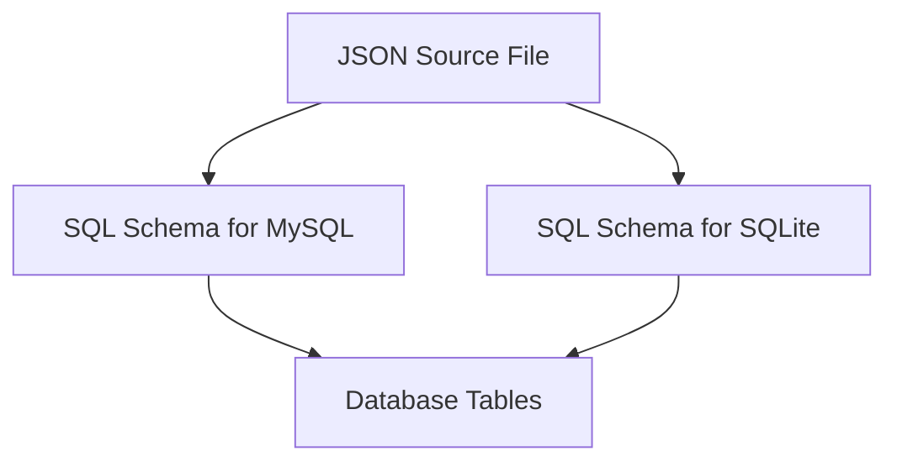

# SQL Schema Overview

The SQL Schema defines the structure of the database tables used to store OAuth-related data. It includes the definitions for tables such as <SwmToken path="schema/mysql/tables-generated.sql" pos="5:7:7" line-data="CREATE TABLE /*_*/oauth_registered_consumer (">`oauth_registered_consumer`</SwmToken>, <SwmToken path="schema/mysql/tables-generated.sql" pos="42:7:7" line-data="CREATE TABLE /*_*/oauth_accepted_consumer (">`oauth_accepted_consumer`</SwmToken>, and <SwmToken path="schema/mysql/tables-generated.sql" pos="62:7:7" line-data="CREATE TABLE /*_*/oauth2_access_tokens (">`oauth2_access_tokens`</SwmToken>. Each table definition specifies the columns, their data types, constraints, and indexes. The schema is generated from a JSON source file (<SwmPath>[schema/tables.json](schema/tables.json)</SwmPath>) and is used to create the actual SQL files for different database systems like MySQL and SQLite. These SQL files are automatically generated and should not be modified directly.

<SwmSnippet path="/schema/mysql/tables-generated.sql" line="1">

---

# SQL Schema Definition

The SQL Schema file is automatically generated using a script and should not be modified directly. It includes definitions for various tables used to store OAuth-related data.

```plsql
-- This file is automatically generated using maintenance/generateSchemaSql.php.
-- Source: schema/tables.json
-- Do not modify this file directly.
-- See https://www.mediawiki.org/wiki/Manual:Schema_changes
```

---

</SwmSnippet>

# Table Definitions

This section defines the <SwmToken path="schema/mysql/tables-generated.sql" pos="5:7:7" line-data="CREATE TABLE /*_*/oauth_registered_consumer (">`oauth_registered_consumer`</SwmToken> table, including its columns, data types, and constraints. Similar definitions exist for other tables like <SwmToken path="schema/mysql/tables-generated.sql" pos="42:7:7" line-data="CREATE TABLE /*_*/oauth_accepted_consumer (">`oauth_accepted_consumer`</SwmToken> and <SwmToken path="schema/mysql/tables-generated.sql" pos="62:7:7" line-data="CREATE TABLE /*_*/oauth2_access_tokens (">`oauth2_access_tokens`</SwmToken>.

<SwmSnippet path="/schema/mysql/tables-generated.sql" line="5">

---

The <SwmToken path="schema/mysql/tables-generated.sql" pos="5:7:7" line-data="CREATE TABLE /*_*/oauth_registered_consumer (">`oauth_registered_consumer`</SwmToken> table stores information about client consumers, including their keys, names, user IDs, and other relevant details.

```plsql
CREATE TABLE /*_*/oauth_registered_consumer (
  oarc_id INT UNSIGNED AUTO_INCREMENT NOT NULL,
  oarc_consumer_key VARBINARY(32) NOT NULL,
  oarc_name VARBINARY(128) NOT NULL,
  oarc_user_id INT UNSIGNED NOT NULL,
  oarc_version VARBINARY(32) NOT NULL,
  oarc_callback_url BLOB NOT NULL,
  oarc_callback_is_prefix TINYBLOB DEFAULT NULL,
  oarc_description BLOB NOT NULL,
  oarc_email VARBINARY(255) NOT NULL,
  oarc_email_authenticated BINARY(14) DEFAULT NULL,
  oarc_developer_agreement TINYINT DEFAULT 0 NOT NULL,
  oarc_owner_only TINYINT DEFAULT 0 NOT NULL,
  oarc_wiki VARBINARY(32) NOT NULL,
  oarc_grants BLOB NOT NULL,
  oarc_registration BINARY(14) NOT NULL,
  oarc_secret_key VARBINARY(32) DEFAULT NULL,
  oarc_rsa_key BLOB DEFAULT NULL,
  oarc_restrictions BLOB NOT NULL,
  oarc_stage TINYINT UNSIGNED DEFAULT 0 NOT NULL,
  oarc_stage_timestamp BINARY(14) NOT NULL,
```

---

</SwmSnippet>

# JSON Source File

The JSON source file contains the definitions for the tables, which are used to generate the SQL Schema. Any changes to the schema should be made in this file.

<SwmSnippet path="/schema/tables.json" line="1">

---

The JSON source file defines the structure of the <SwmToken path="schema/tables.json" pos="3:7:7" line-data="		&quot;name&quot;: &quot;oauth_registered_consumer&quot;,">`oauth_registered_consumer`</SwmToken> table, including its columns and their properties.

```json
[
	{
		"name": "oauth_registered_consumer",
		"comment": "Client consumers (proposed as well as and accepted)",
		"columns": [
			{
				"name": "oarc_id",
				"comment": "Internal numeric consumer ID (1:1 with oarc_consumer_key)",
				"type": "integer",
				"options": { "autoincrement": true, "notnull": true, "unsigned": true }
```

---

</SwmSnippet>

<SwmSnippet path="/schema/sqlite/tables-generated.sql" line="1">

---

# SQLite Schema

Similar to the MySQL schema, the SQLite schema is also automatically generated and should not be modified directly. It ensures compatibility with SQLite databases.

```plsql
-- This file is automatically generated using maintenance/generateSchemaSql.php.
-- Source: schema/tables.json
-- Do not modify this file directly.
-- See https://www.mediawiki.org/wiki/Manual:Schema_changes
```

---

</SwmSnippet>

# Main Functions

There are several main functions in this schema. Some of them are <SwmToken path="schema/mysql/tables-generated.sql" pos="5:7:7" line-data="CREATE TABLE /*_*/oauth_registered_consumer (">`oauth_registered_consumer`</SwmToken>, <SwmToken path="schema/mysql/tables-generated.sql" pos="42:7:7" line-data="CREATE TABLE /*_*/oauth_accepted_consumer (">`oauth_accepted_consumer`</SwmToken>, and <SwmToken path="schema/mysql/tables-generated.sql" pos="62:7:7" line-data="CREATE TABLE /*_*/oauth2_access_tokens (">`oauth2_access_tokens`</SwmToken>. We will dive a little into <SwmToken path="schema/mysql/tables-generated.sql" pos="5:7:7" line-data="CREATE TABLE /*_*/oauth_registered_consumer (">`oauth_registered_consumer`</SwmToken> and <SwmToken path="schema/mysql/tables-generated.sql" pos="42:7:7" line-data="CREATE TABLE /*_*/oauth_accepted_consumer (">`oauth_accepted_consumer`</SwmToken>.

<SwmSnippet path="/schema/mysql/tables-generated.sql" line="42">

---

## <SwmToken path="schema/mysql/tables-generated.sql" pos="42:7:7" line-data="CREATE TABLE /*_*/oauth_accepted_consumer (">`oauth_accepted_consumer`</SwmToken>

The <SwmToken path="schema/mysql/tables-generated.sql" pos="42:7:7" line-data="CREATE TABLE /*_*/oauth_accepted_consumer (">`oauth_accepted_consumer`</SwmToken> table records the grant approvals by users for consumers, including access tokens and related metadata.

```plsql
CREATE TABLE /*_*/oauth_accepted_consumer (
  oaac_id INT UNSIGNED AUTO_INCREMENT NOT NULL,
  oaac_wiki VARBINARY(255) NOT NULL,
  oaac_user_id INT UNSIGNED NOT NULL,
  oaac_consumer_id INT UNSIGNED NOT NULL,
  oaac_access_token VARBINARY(32) NOT NULL,
  oaac_access_secret VARBINARY(32) NOT NULL,
  oaac_grants BLOB NOT NULL,
  oaac_accepted BINARY(14) NOT NULL,
  oaac_oauth_version TINYINT DEFAULT 1 NOT NULL,
  UNIQUE INDEX oaac_access_token (oaac_access_token),
  UNIQUE INDEX oaac_user_consumer_wiki (
    oaac_user_id, oaac_consumer_id, oaac_wiki
  ),
  INDEX oaac_consumer_user (oaac_consumer_id, oaac_user_id),
  INDEX oaac_user_id (oaac_user_id, oaac_id),
  PRIMARY KEY(oaac_id)
) /*$wgDBTableOptions*/;
```

---

</SwmSnippet>

<SwmSnippet path="/schema/mysql/tables-generated.sql" line="62">

---

## <SwmToken path="schema/mysql/tables-generated.sql" pos="62:7:7" line-data="CREATE TABLE /*_*/oauth2_access_tokens (">`oauth2_access_tokens`</SwmToken>

The <SwmToken path="schema/mysql/tables-generated.sql" pos="62:7:7" line-data="CREATE TABLE /*_*/oauth2_access_tokens (">`oauth2_access_tokens`</SwmToken> table manages the access tokens used in <SwmToken path="schema/tables.json" pos="146:7:7" line-data="				&quot;comment&quot;: &quot;OAuth2 flag indicating if consumer can be trusted with keeping secrets&quot;,">`OAuth2`</SwmToken> requests, including their identifiers, expiration times, and revocation status.

```plsql
CREATE TABLE /*_*/oauth2_access_tokens (
  oaat_id INT UNSIGNED AUTO_INCREMENT NOT NULL,
  oaat_identifier VARCHAR(255) NOT NULL,
  oaat_expires VARBINARY(14) NOT NULL,
  oaat_acceptance_id INT UNSIGNED NOT NULL,
  oaat_revoked TINYINT DEFAULT 0 NOT NULL,
  UNIQUE INDEX oaat_identifier (oaat_identifier),
  INDEX oaat_acceptance_id (oaat_acceptance_id),
  PRIMARY KEY(oaat_id)
) /*$wgDBTableOptions*/;
```

---

</SwmSnippet>

&nbsp;

*This is an auto-generated document by Swimm AI 🌊 and has not yet been verified by a human*

<SwmMeta version="3.0.0" repo-id="Z2l0aHViJTNBJTNBbWVkaWF3aWtpLWV4dGVuc2lvbnMtT0F1dGglM0ElM0FTd2ltbS1EZW1v" repo-name="mediawiki-extensions-OAuth"><sup>Powered by [Swimm](/)</sup></SwmMeta>
