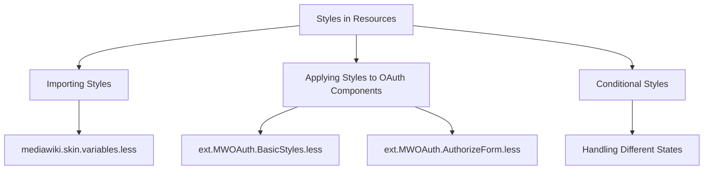

# Importing Styles

Styles are imported from `mediawiki.skin.variables.less` to leverage predefined variables for colors and other design elements. This ensures a consistent look and feel across different components.

# Applying Styles to OAuth Components

Specific styles are applied to various OAuth-related components, such as registration and management forms, to maintain visual consistency. For example, the file <SwmPath>[resources/modules/ext.MWOAuth.BasicStyles.less](resources/modules/ext.MWOAuth.BasicStyles.less)</SwmPath> contains styles for these components, while <SwmPath>[resources/modules/ext.MWOAuth.AuthorizeForm.less](resources/modules/ext.MWOAuth.AuthorizeForm.less)</SwmPath> includes styles specific to the OAuth authorization form, ensuring elements like font size and color are consistent.

# Conditional Styles

Conditional styles are used to handle different states, such as hiding elements in certain conditions to avoid flicker or display issues. This helps in maintaining a smooth user experience by ensuring that elements are displayed correctly based on the current state.

&nbsp;

*This is an auto-generated document by Swimm AI 🌊 and has not yet been verified by a human*

<SwmMeta version="3.0.0" repo-id="Z2l0aHViJTNBJTNBbWVkaWF3aWtpLWV4dGVuc2lvbnMtT0F1dGglM0ElM0FTd2ltbS1EZW1v" repo-name="mediawiki-extensions-OAuth">Powered by [Swimm](/)</SwmMeta>
