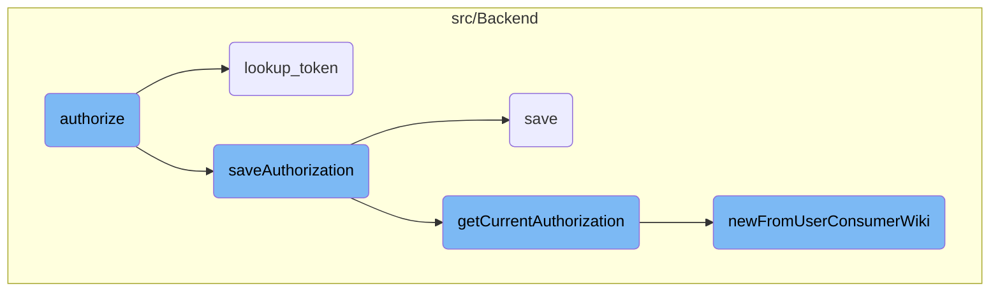
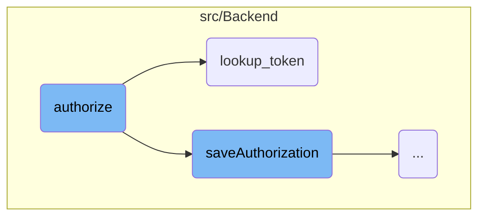
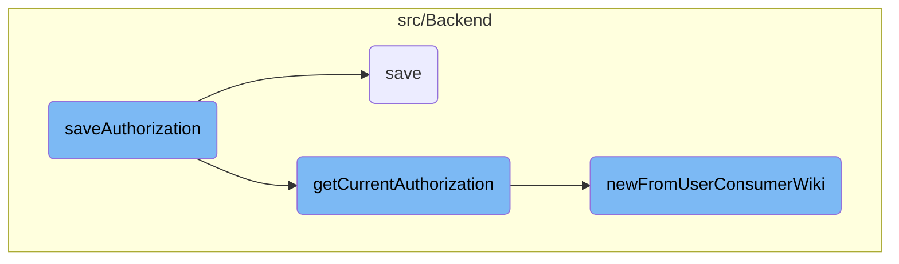

In this document, we will explain the process of authorizing a user. The process involves several steps, including verifying the user's global account, checking for existing authorizations, updating or creating new authorizations, and saving the authorization details to the database.

Here is a high level diagram of the flow, showing only the most important functions:



# Flow drill down

First, we'll zoom into this section of the flow:



<SwmSnippet path="src/Backend/OAuth1Consumer.php" line="47">

---

## Authorize

THe flow starts with the <SwmToken path="src/Backend/OAuth1Consumer.php" pos="47:5:5" line-data="	public function authorize( User $mwUser, $update, $grants, $requestTokenKey = null ) {">`authorize`</SwmToken> function that is responsible for updating the request token so that the consumer can swap it for an access token.&nbsp;

It performs authorization checks, generates a verification code, and updates the request token with this code. The function then saves the authorization and generates a new access token if necessary. Finally, it updates the request token with the access token and generates a callback URL to redirect the user back to the consumer.

```
	public function authorize( User $mwUser, $update, $grants, $requestTokenKey = null ) {
		$this->conductAuthorizationChecks( $mwUser );

		// Generate and Update the tokens:
		// * Generate a new Verification code, and add it to the request token
		// * Either add or update the authorization
		// ** Generate a new access token if this is a new authorization
		// * Resave request token with the access token
		$verifyCode = MWCryptRand::generateHex( 32 );
		$store = Utils::newMWOAuthDataStore();
		$requestToken = $store->lookup_token( $this, 'request', $requestTokenKey );
		if ( !$requestToken || !( $requestToken instanceof MWOAuthToken ) ) {
			throw new MWOAuthException( 'mwoauthserver-invalid-request-token', [
				'consumer' => $this->getConsumerKey(),
				'consumer_name' => $this->getName(),
				'token_key' => $requestTokenKey,
			] );
		}
		$requestToken->addVerifyCode( $verifyCode );
```

---

</SwmSnippet>

<SwmSnippet path="src/Backend/MWOAuthDataStore.php" line="77">

---

## Lookup Token

The <SwmToken path="src/Backend/MWOAuthDataStore.php" pos="77:5:5" line-data="	public function lookup_token( $consumer, $token_type, $token ) {">`lookup_token`</SwmToken> function retrieves either a request or access token from the data store. If the toke type is <SwmToken path="/src/Backend/MWOAuthDataStore.php" pos="80:11:11" line-data="		if ( $token_type === &#39;request&#39; ) {">`request`</SwmToken> the function retrieves the token from the cache.&nbsp;

```
	public function lookup_token( $consumer, $token_type, $token ) {
		$this->logger->debug( __METHOD__ . ": Looking up $token_type token '$token'" );

		if ( $token_type === 'request' ) {
			$returnToken = $this->tokenCache->get( Utils::getCacheKey(
				'token',
				$consumer->key,
				$token_type,
				$token
			) );
			if ( $returnToken === '**USED**' ) {
				throw new MWOAuthException( 'mwoauthdatastore-request-token-already-used', [
					Message::rawParam( Linker::makeExternalLink(
						'https://www.mediawiki.org/wiki/Help:OAuth/Errors#E009',
						'E009',
						true
					) ),
					'consumer' => $consumer->key,
				] );
			}
			if ( $token === null || !( $returnToken instanceof MWOAuthToken ) ) {
				throw new MWOAuthException( 'mwoauthdatastore-request-token-not-found', [
					Message::rawParam( Linker::makeExternalLink(
						'https://www.mediawiki.org/wiki/Help:OAuth/Errors#E004',
						'E004',
						true
					) ),
					'consumer' => $consumer->key,
				] );
			}
```

---

</SwmSnippet>

<SwmSnippet path="/src/Backend/MWOAuthDataStore.php" line="107">

---

For <SwmToken path="/src/Backend/MWOAuthDataStore.php" pos="107:13:13" line-data="		} elseif ( $token_type === &#39;access&#39; ) {">`access`</SwmToken> tokens, it retrieves the token from the database and ensures it matches the expected consumer.

```hack
		} elseif ( $token_type === 'access' ) {
			$cmra = ConsumerAcceptance::newFromToken( $this->centralReplica, $token );
			if ( !$cmra && $this->centralPrimary ) {
				// try primary database in case there is replication lag T124942
				$cmra = ConsumerAcceptance::newFromToken( $this->centralPrimary, $token );
			}
			if ( !$cmra ) {
				throw new MWOAuthException( 'mwoauthdatastore-access-token-not-found' );
			}

			// Ensure the cmra's consumer matches the expected consumer (T103023)
			$mwconsumer = ( $consumer instanceof Consumer )
				? $consumer : $this->lookup_consumer( $consumer->key );
			if ( !$mwconsumer || $mwconsumer->getId() !== $cmra->getConsumerId() ) {
				throw new MWOAuthException( 'mwoauthdatastore-access-token-not-found', [
					'consumer' => $mwconsumer ? $mwconsumer->getConsumerKey() : '',
					'cmra_id' => $cmra->getId(),
				] );
			}

			$secret = Utils::hmacDBSecret( $cmra->getAccessSecret() );
			$returnToken = new MWOAuthToken( $cmra->getAccessToken(), $secret );
```

---

</SwmSnippet>

Now, lets zoom into this section of the flow:



<SwmSnippet path="/src/Backend/Consumer.php" line="655">

---

## Saving the token

### Verifying User's Global Account

First, we verify if the user has a global account by calling <SwmToken path="src/Backend/Consumer.php" pos="657:6:8" line-data="		$centralUserId = Utils::getCentralIdFromLocalUser( $mwUser );">`Utils::getCentralIdFromLocalUser`</SwmToken>. If the user does not have a global account, an exception is thrown, preventing further processing.

```hack
	protected function saveAuthorization( User $mwUser, $update, $grants ) {
		// CentralAuth may abort here if there is no global account for this user
		$centralUserId = Utils::getCentralIdFromLocalUser( $mwUser );
		if ( !$centralUserId ) {
			throw new MWOAuthException(
				'mwoauthserver-invalid-user',
				[
					'consumer_name' => $this->getName(),
					Message::rawParam( Linker::makeExternalLink(
						'https://www.mediawiki.org/wiki/Help:OAuth/Errors#E008',
						'E008',
						true
					) ),
					'consumer' => $this->getConsumerKey(),
				]
			);
		}
```

---

</SwmSnippet>

<SwmSnippet path="/src/Backend/Consumer.php" line="673">

---

### Checking for Existing Authorization

Next, we check if there is an existing authorization for the user by calling <SwmToken path="src/Backend/Consumer.php" pos="675:9:9" line-data="		$cmra = $this-&gt;getCurrentAuthorization( $mwUser, WikiMap::getCurrentWikiId() );">`getCurrentAuthorization`</SwmToken>. This helps determine whether we need to update an existing authorization or create a new one.

```hack
		$dbw = Utils::getCentralDB( DB_PRIMARY );
		// Check if this authorization exists
		$cmra = $this->getCurrentAuthorization( $mwUser, WikiMap::getCurrentWikiId() );

```

---

</SwmSnippet>

<SwmSnippet path="/src/Backend/Consumer.php" line="677">

---

### Updating Existing Authorization

If an update is requested and an existing authorization is found, we update the authorization details such as the wiki and grants. This ensures that the user's permissions are kept up-to-date.

```hack
		if ( $update ) {
			// This should be an update to an existing authorization
			if ( !$cmra ) {
				// update requested, but no existing key
				throw new MWOAuthException( 'mwoauthserver-invalid-request', [
					'consumer' => $this->getConsumerKey(),
					'consumer_name' => $this->getName(),
				] );
			}
			$cmra->setFields( [
				'wiki'   => $this->getWiki(),
				'grants' => $grants
			] );
			$cmra->save( $dbw );
```

---

</SwmSnippet>

<SwmSnippet path="/src/Backend/Consumer.php" line="691">

---

### Creating New Authorization

If no existing authorization is found, we create a new authorization entry in the database. This involves generating a new access token and saving the authorization details, ensuring that the user can interact with the consumer application.

```hack
		} elseif ( !$cmra ) {
			// Add the Authorization to the database
			$accessToken = MWOAuthDataStore::newToken();
			$cmra = ConsumerAcceptance::newFromArray( [
				'id'           => null,
				'wiki'         => $this->getWiki(),
				'userId'       => $centralUserId,
				'consumerId'   => $this->getId(),
				'accessToken'  => $accessToken->key,
				'accessSecret' => $accessToken->secret,
				'grants'       => $grants,
				'accepted'     => wfTimestampNow(),
				'oauth_version' => $this->getOAuthVersion()
			] );
			$cmra->save( $dbw );
```

---

</SwmSnippet>

<SwmSnippet path="/src/Backend/Consumer.php" line="531">

---

## Retrieving Current Authorization

The <SwmToken path="src/Backend/Consumer.php" pos="531:5:5" line-data="	public function getCurrentAuthorization( User $mwUser, $wikiId ) {">`getCurrentAuthorization`</SwmToken> function, mentioned earlier, retrieves the most specific authorization for the user, considering different levels of specificity such as <SwmToken path="src/Backend/Consumer.php" pos="518:13:15" line-data="	 * This will choose the most wiki-specific access token. The precedence is:">`wiki-specific`</SwmToken> and global authorizations. This helps in determining the appropriate authorization to update or use.

```hack
	public function getCurrentAuthorization( User $mwUser, $wikiId ) {
		$dbr = Utils::getCentralDB( DB_REPLICA );

		$centralUserId = Utils::getCentralIdFromLocalUser( $mwUser );
		if ( !$centralUserId ) {
			throw new MWOAuthException(
				'mwoauthserver-invalid-user',
				[
					'consumer_name' => $this->getName(),
					Message::rawParam( Linker::makeExternalLink(
						'https://www.mediawiki.org/wiki/Help:OAuth/Errors#E008',
						'E008',
						true
					) ),
					'consumer' => $this->getConsumerKey(),
				]
			);
		}

		$checkWiki = $this->getWiki() !== '*' ? $this->getWiki() : $wikiId;

```

---

</SwmSnippet>

<SwmSnippet path="/src/Backend/ConsumerAcceptance.php" line="131">

---

## Creating Authorization Object

The <SwmToken path="src/Backend/ConsumerAcceptance.php" pos="131:7:7" line-data="	public static function newFromUserConsumerWiki(">`newFromUserConsumerWiki`</SwmToken> function creates a <SwmToken path="src/Backend/Consumer.php" pos="694:6:6" line-data="			$cmra = ConsumerAcceptance::newFromArray( [">`ConsumerAcceptance`</SwmToken> object from the database row corresponding to the user's authorization. This object encapsulates the authorization details and is used in further processing.

```hack
	public static function newFromUserConsumerWiki(
		IDatabase $db, $userId, $consumer,
		$wiki, $flags = 0, $oauthVersion = Consumer::OAUTH_VERSION_1
	) {
		$queryBuilder = $db->newSelectQueryBuilder()
			->select( array_values( static::getFieldColumnMap() ) )
			->from( static::getTable() )
			->where( [
				'oaac_user_id' => $userId,
				'oaac_consumer_id' => $consumer->getId(),
				'oaac_oauth_version' => $oauthVersion,
				'oaac_wiki' => (string)$wiki
			] )
			->caller( __METHOD__ );
		if ( $flags & IDBAccessObject::READ_LOCKING ) {
			$queryBuilder->forUpdate();
		}
		$row = $queryBuilder->fetchRow();

		if ( $row ) {
			$consumer = new self();
```

---

</SwmSnippet>

&nbsp;

*This is an auto-generated document by Swimm 🌊 and has not yet been verified by a human*

<SwmMeta version="3.0.0" repo-id="Z2l0aHViJTNBJTNBbWVkaWF3aWtpLWV4dGVuc2lvbnMtT0F1dGglM0ElM0FTd2ltbS1EZW1v" repo-name="mediawiki-extensions-OAuth"><sup>Powered by [Swimm](https://app.swimm.io/)</sup></SwmMeta>
