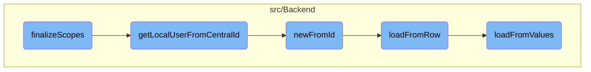

In this document, we will explain the process of validating and filtering scopes for a client. The process involves validating the requested scopes based on the client's grant type and user permissions, replacing default scopes, and filtering out scopes that are not allowed or not approved by the user.

The flow starts by validating the requested scopes based on the client's grant type and user permissions. If the grant type is not <SwmToken path="src/Repository/ScopeRepository.php" pos="69:11:11" line-data="		if ( $grantType !== &#39;authorization_code&#39; ) {">`authorization_code`</SwmToken>, it filters out scopes that are not allowed for the client. If the grant type is <SwmToken path="src/Repository/ScopeRepository.php" pos="69:11:11" line-data="		if ( $grantType !== &#39;authorization_code&#39; ) {">`authorization_code`</SwmToken>, it retrieves the local user from the central ID and filters out scopes that are not approved by the user. This ensures that only valid and approved scopes are finalized for the client.

# Flow drill down



<SwmSnippet path="/src/Repository/ScopeRepository.php" line="53">

---

## Validating and Filtering Scopes

The <SwmToken path="src/Repository/ScopeRepository.php" pos="65:5:5" line-data="	public function finalizeScopes( array $scopes, $grantType,">`finalizeScopes`</SwmToken> function is responsible for validating the requested scopes based on the client's grant type and user permissions. It first replaces the default scopes and then filters out scopes that are not allowed for the client if the grant type is not <SwmToken path="src/Repository/ScopeRepository.php" pos="69:11:11" line-data="		if ( $grantType !== &#39;authorization_code&#39; ) {">`authorization_code`</SwmToken>. If the grant type is <SwmToken path="src/Repository/ScopeRepository.php" pos="69:11:11" line-data="		if ( $grantType !== &#39;authorization_code&#39; ) {">`authorization_code`</SwmToken>, it retrieves the local user from the central ID and filters out scopes that are not approved by the user.

```hack
	/**
	 * Given a client, grant type and optional user identifier
	 * validate the set of scopes requested are valid and optionally
	 * append additional scopes or remove requested scopes.
	 *
	 * @param ScopeEntityInterface[] $scopes
	 * @param string $grantType
	 * @param ClientEntityInterface|ClientEntity $clientEntity
	 * @param null|string $userIdentifier
	 *
	 * @return ScopeEntityInterface[]
	 */
	public function finalizeScopes( array $scopes, $grantType,
		ClientEntityInterface $clientEntity, $userIdentifier = null ) {
		$scopes = $this->replaceDefaultScope( $scopes, $clientEntity );

		if ( $grantType !== 'authorization_code' ) {
			// For grants that do not require approval,
			// just filter out the scopes that are not allowed for the client
			return array_filter(
				$scopes,
```

---

</SwmSnippet>

<SwmSnippet path="/src/Backend/Utils.php" line="295">

---

### Retrieving Local User

The <SwmToken path="src/Backend/Utils.php" pos="301:7:7" line-data="	public static function getLocalUserFromCentralId( $userId ) {">`getLocalUserFromCentralId`</SwmToken> function retrieves a local user object based on a central wiki user ID. This is crucial for validating user-specific scopes in the <SwmToken path="src/Repository/ScopeRepository.php" pos="65:5:5" line-data="	public function finalizeScopes( array $scopes, $grantType,">`finalizeScopes`</SwmToken> function.

```hack
	/**
	 * Given a central wiki user ID, get a local User object
	 *
	 * @param int $userId
	 * @return User|false False if not found
	 */
	public static function getLocalUserFromCentralId( $userId ) {
		global $wgMWOAuthSharedUserIDs, $wgMWOAuthSharedUserSource;

		// global ID required via hook
		if ( $wgMWOAuthSharedUserIDs ) {
			$lookup = MediaWikiServices::getInstance()
				->getCentralIdLookupFactory()
				->getLookup( $wgMWOAuthSharedUserSource );
			$user = $lookup->localUserFromCentralId( $userId );
			if ( $user === null || !$lookup->isAttached( $user ) ) {
				return false;
			}
			return User::newFromIdentity( $user );
		}

```

---

</SwmSnippet>

<SwmSnippet path="/src/Backend/MWOAuthDAO.php" line="96">

---

### Creating User Entity

The <SwmToken path="src/Backend/MWOAuthDAO.php" pos="103:9:9" line-data="	final public static function newFromId( IDatabase $db, $id, $flags = 0 ) {">`newFromId`</SwmToken> function creates a new user entity from the database using the user ID. This entity is used to load user-specific data required for scope validation.

```hack
	/**
	 * @param IDatabase $db
	 * @param int $id
	 * @param int $flags IDBAccessObject::READ_* bitfield
	 * @return static|bool Returns false if not found
	 * @throws DBError
	 */
	final public static function newFromId( IDatabase $db, $id, $flags = 0 ) {
		$queryBuilder = $db->newSelectQueryBuilder()
			->select( array_values( static::getFieldColumnMap() ) )
			->from( static::getTable() )
			->where( [ static::getIdColumn() => (int)$id ] )
			->caller( __METHOD__ );
		if ( $flags & IDBAccessObject::READ_LOCKING ) {
			$queryBuilder->forUpdate();
		}
		$row = $queryBuilder->fetchRow();

		if ( $row ) {
			$class = static::getConsumerClass( (array)$row );
			$consumer = new $class();
```

---

</SwmSnippet>

<SwmSnippet path="/src/Backend/MWOAuthDAO.php" line="375">

---

### Loading User Data

The <SwmToken path="src/Backend/MWOAuthDAO.php" pos="380:7:7" line-data="	final protected function loadFromRow( IDatabase $db, $row ) {">`loadFromRow`</SwmToken> function loads user data from a database row into the user entity. This data is essential for validating the user's approved scopes.

```hack
	/**
	 * @param IDatabase $db
	 * @param stdClass|array $row
	 * @return void
	 */
	final protected function loadFromRow( IDatabase $db, $row ) {
		$row = $this->decodeRow( $db, (array)$row );
		$values = [];
		foreach ( static::getFieldColumnMap() as $field => $column ) {
			$values[$field] = $row[$column];
		}
		$this->loadFromValues( $values );
		$this->daoOrigin = 'db';
		$this->daoPending = false;
	}
```

---

</SwmSnippet>

<SwmSnippet path="/src/Backend/MWOAuthDAO.php" line="353">

---

### Setting User Values

The <SwmToken path="src/Backend/MWOAuthDAO.php" pos="356:7:7" line-data="	final protected function loadFromValues( array $values ) {">`loadFromValues`</SwmToken> function sets the values of the user entity from an array. This finalizes the user data required for scope validation.

```hack
	/**
	 * @param array $values
	 */
	final protected function loadFromValues( array $values ) {
		foreach ( static::getFieldColumnMap() as $field => $column ) {
			if ( !array_key_exists( $field, $values ) ) {
				throw new MWException( get_class( $this ) . " requires '$field' field." );
			}
			$this->$field = $values[$field];
		}
		$this->normalizeValues();
		$this->daoOrigin = 'new';
		$this->daoPending = true;
	}
```

---

</SwmSnippet>

&nbsp;

*This is an auto-generated document by Swimm AI 🌊 and has not yet been verified by a human*

<SwmMeta version="3.0.0" repo-id="Z2l0aHViJTNBJTNBbWVkaWF3aWtpLWV4dGVuc2lvbnMtT0F1dGglM0ElM0FTd2ltbS1EZW1v" repo-name="mediawiki-extensions-OAuth"><sup>Powered by [Swimm](/)</sup></SwmMeta>
